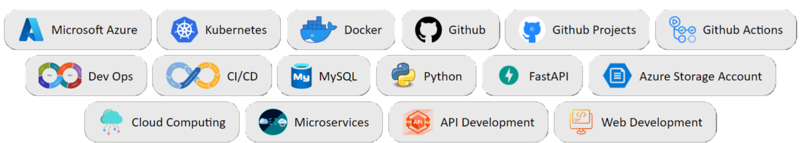
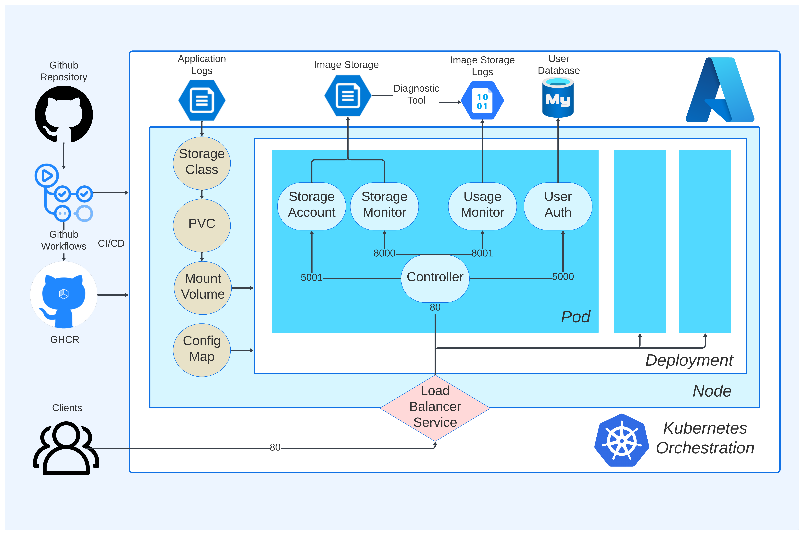
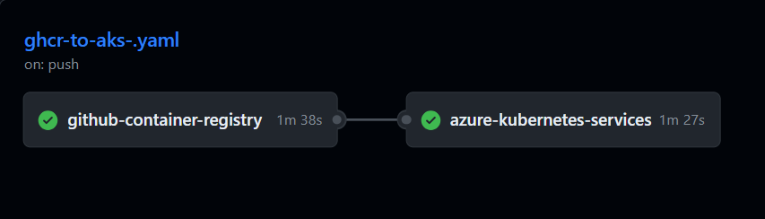

# **Pixa - Cloud Gallery**

Welcome to Pixa, a sophisticated cloud-based image storage and management solution. This repository houses the deployment architecture, storage units, and other essential components that power Pixa. Explore the seamless deployment process, microservices structure, and CI/CD automation.

<p align="center">
  
</p>

# **Table of Content**

- [**Pixa - Cloud Gallery**](#pixa---cloud-gallery)
- [**Table of Content**](#table-of-content)
- [**Deployment Architechture**](#deployment-architechture)
- [**Storage Units**](#storage-units)
  - [ User Database](#-user-database)
  - [ Image Storage](#-image-storage)
  - [ Image Storage Logs](#-image-storage-logs)
  - [ Application Logs](#-application-logs)
- [**Deployment**](#deployment)
  - [Microservices](#microservices)
  - [Rollback](#rollback)
  - [Load Balancer Service](#load-balancer-service)
  - [ConfigMap](#configmap)
  - [Volume for Application Logs](#volume-for-application-logs)
  - [Other Features](#other-features)
    - [JWT Authentication](#jwt-authentication)
    - [Threading for Parallelism](#threading-for-parallelism)
    - [JSONResponses](#jsonresponses)
- [**CI/CD**](#cicd)
  - [Push Images to GHCR](#push-images-to-ghcr)
  - [Deploy to AKS](#deploy-to-aks)
  - [Status on Github Actions](#status-on-github-actions)

# **Deployment Architechture**

<p align="center">
  
</p>


# **Storage Units**

##  User Database
- **Azure Service**: [Azure Database for MySQL flexible server](https://learn.microsoft.com/en-us/azure/mysql/flexible-server/overview) 
- **Used by Microservice**: auth-service
- It stores user credentials for authentication

##  Image Storage
- **Azure Service**: [Azure Storage Account File Service](https://learn.microsoft.com/en-us/azure/storage/files/storage-files-introduction) 
- **Used by Microservice**: storage-account-service ; storage-monitor-service
- It stores images uploaded by users

##  Image Storage Logs
- **Azure Service**: [Azure Storage Account Blob Service](https://learn.microsoft.com/en-us/azure/storage/blobs/storage-blobs-introduction) 
- **Used by Microservice**: usage-monitor-service
- Image Storage generates logs on every event that are automatically stored here using Azure Diagnostic Tools

##  Application Logs
- **Azure Service**: [Azure Storage Account File Service](https://learn.microsoft.com/en-us/azure/storage/files/storage-files-introduction) 
- **Used by Microservice**: all
- This is the persistent storage that is mounted in each container in the pod to store application logs

# **Deployment**

## Microservices

- All microservices are developed using FastAPI
- They run on different ports and communicate in the pod using localhost
- Node's Public IP is attached to only controller-service using LoadBalancer Service thus exposing it to online traffic
- Single Pod in Deployment consists of following 5 services that are pulled from github container registry
  - [controller-service](microservices/controller-service/README.md)
  - [auth-service](microservices/auth-service/README.md)
  - [storage-account-service](microservices/storage-account-service/README.md)
  - [storage-monitor-service](microservices/storage-monitor-service/README.md)
  - [usage-monitor-service](microservices/usage-monitor-service/README.md)

Running Locally
```cmd
cd microservices/auth-service
pip install -r requirements.txt
uvicorn main:app --host 0.0.0.0 --port 5000
```
Building Docker Image
```cmd
cd microservices/auth-service
docker build -t pixa-auth-service .
docker run -p 5000:5000 pixa-auth-service
```
Using Remote Image
```cmd
docker pull ghcr.io/geetu040/pixa-auth-service:latest
docker run -p 5000:5000 pixa-auth-service
```
Definition in Deployment
```yaml
kind: Deployment
...
spec:
  ...
  template:
    ...
    spec:

      containers:

        - name: pixa-controller-service
          image: ghcr.io/geetu040/pixa-controller-service
          ports:
            - containerPort: 80
          ...

        - name: pixa-auth-service
          image: ghcr.io/geetu040/pixa-auth-service
          ports:
            - containerPort: 5000
          ...

        - name: pixa-storage-account-service
          image: ghcr.io/geetu040/pixa-storage-account-service
          ports:
            - containerPort: 5001
          ...

        - name: pixa-storage-monitor-service
          image: ghcr.io/geetu040/pixa-storage-monitor-service
          ports:
            - containerPort: 8000
          ...

        - name: pixa-usage-monitor-service
          image: ghcr.io/geetu040/pixa-usage-monitor-service
          ports:
            - containerPort: 8001
          ...
```

## Rollback

A total of 3 replicas have been created for deployment which means there will always be 3 pods running in the node. If on pod fails, other 2 will still be available for service. Remember that each pod contains 5 containers (5 microservices)
```yaml
apiVersion: apps/v1
kind: Deployment
...
spec: 
  ...
  replicas: 3
```

## Load Balancer Service

This service serves the following functions
- It balances the load between multiples replicas of deployment thus distributing the traffic
- It balances at Layer 4 which is the transport layer
- It maps the Node's public IP address to port 80 of pod which is controller-service, thus allowing external traffic to communicate with the pod

```yaml
apiVersion: v1
kind: Service
metadata:
  name: pixa-service
spec:
  selector:
    app: pixa-deploy
  type: LoadBalancer
  ports:
  - protocol: TCP
    port: 80
    targetPort: 80
```

## ConfigMap
All the application secrets and variables are stored in a configmap that are accessable as enviromental variables
<br />
Declaration: [manifests/configmap.yaml](manifests/configmap.yaml)
```yaml
kind: ConfigMap
data:
  PIX_DB_HOST: 'your-db-host-placeholder'
  PIX_DB_DATABASE: 'your-db-name-placeholder'
  PIX_DB_USER: 'your-db-user-placeholder'
  PIX_DB_PASSWORD: 'your-db-password-placeholder'
  ...
```
Referred in Deployment: [manifests\deployment.yaml](manifests\deployment.yaml)
```yaml
kind: Deployment
...
containers:
- name: pixa-controller-service
  image: ghcr.io/geetu040/pixa-controller-service
  envFrom:
  - configMapRef:
    name: pixa-config
```
Usage in Containers: [microservices\auth-service\config.py](microservices\auth-service\config.py)
```python
import os
HOST = os.environ.get("PIX_DB_HOST")
DATABASE = os.environ.get("PIX_DB_DATABASE")
USER = os.environ.get("PIX_DB_USER")
PASSWORD = os.environ.get("PIX_DB_PASSWORD")
```

## Volume for Application Logs

A persistent volume is mounted in each container to store application logs
<br />
If an application or container fails or stops, the logs are always saved in the persistent storage, therefore it becomes easy to find and fix a bug by getting complete description of failure
<br />

Declaration: [manifests/storageclass.yaml](manifests/storageclass.yaml)
```yaml
apiVersion: storage.k8s.io/v1
kind: StorageClass
metadata:
  name: pixa-sc
provisioner: kubernetes.io/azure-file
mountOptions:
  - dir_mode=0777
  - file_mode=0777
  - uid=1000
  - gid=1000
  - mfsymlinks
  - cache=strict
```

Creating Claim: [manifests/persistentvolumeclaim.yaml](manifests/persistentvolumeclaim.yaml)
```yaml
apiVersion: v1
kind: PersistentVolumeClaim
metadata:
  name: pixa-pvc
spec:
  accessModes:
  - ReadWriteMany   # ReadWriteOnce, ReadOnlyMany or ReadWriteMany
  # storageClassName: hostpath
  storageClassName: pixa-sc
  resources:
    requests:
      storage: 1Gi
```
Referred in Deployment: [manifests\deployment.yaml](manifests\deployment.yaml)
```yaml
kind: Deployment
...
volumes:
- name: volume
  persistentVolumeClaim:
  claimName: pixa-pvc
containers:
- name: pixa-controller-service
  image: ghcr.io/geetu040/pixa-controller-service
  ...
  volumeMounts:
  - mountPath: "/mnt"
  name: volume
```
Usage in Containers for saving logs: [microservices\auth-service\Dockerfile](microservices\auth-service\Dockerfile)
```Dockerfile
FROM python:3.9-slim
...
CMD ["sh", "-c", "uvicorn main:app --host 0.0.0.0 --port 5000 >> /mnt/auth-service.log"]

```

## Other Features

### JWT Authentication

User credentials are authenticated and jwt tokens in headers are used for keeping users logged in
```python
from jose import jwt

def create_token(username: str):
  to_encode = {'sub': username}
  token = jwt.encode(to_encode, SECRET_KEY, algorithm=ALGORITHM)
  return token

def decode_token(token: str):
  payload = jwt.decode(token, SECRET_KEY, algorithms=[ALGORITHM])
  username = payload.get("sub", None)
  return username
```

### Threading for Parallelism

Threading has been used where the contoller needs to communicate with other services to get data or create user asynchronously

[microservices\controller-service\service.py](microservices\controller-service\service.py)
```python
def create_user(username, password):

  with ThreadPoolExecutor() as executor:
    # Execute the functions concurrently
    creater1_future = executor.submit(
      create_user_in_auth_service,
      username, password
    )
    creater2_future = executor.submit(
      create_user_in_storage_account_service,
      username, password
    )
```
```python
def load_user_data(username):

  with ThreadPoolExecutor() as executor:
    # Execute the functions concurrently
    storage_usage_future = executor.submit(get_storage_usage, username)
    bandwidth_usage_future = executor.submit(get_bandwidth_usage, username)
    images_links_future = executor.submit(get_images_links, username)

  # Get results from the futures
  storage_usage = storage_usage_future.result()
  bandwidth_usage = bandwidth_usage_future.result()
  images_links = images_links_future.result()
```

### JSONResponses

All endpoints of each service return valid JSON Responses after error handling.
- **Status Code 200** is used to send valid responses
- **Status Code 400** when there is a failure on client side
- **Status Code 500** on server side error

# **CI/CD**

From Building Docker Images to pushing them on Github Container Registry to Deploying them on Azure Kubernetes, everything is automated using github actions. This process involves following steps

## Push Images to GHCR

1. Saving Github Credentials in Repository Secrets
2. Login to GitHub Container Registry
3. Build Docker Images
4. Push Docker Images to Github Container Registry

workflow manifest - [.github/workflows/ghcr-to-aks-.yaml](.github/workflows/ghcr-to-aks-.yaml)
```yaml
github-container-registry:
  runs-on: ubuntu-latest

  steps:
    - name: Checkout Repository
      uses: actions/checkout@v2

    - name: Login to GitHub Container Registry
      run: echo "${{ secrets.TOKEN }}" | docker login ghcr.io -u ${{ github.actor }} --password-stdin

    - name: pixa-auth-service
      run: |
        docker build -t ghcr.io/geetu040/pixa-auth-service:latest microservices/auth-service/
        docker push ghcr.io/geetu040/pixa-auth-service:latest

    ...
```

## Deploy to AKS

1. Save Azure Credentials in Repository Secrets
2. Set up kubelogin for non-interactive login
3. Get K8s context
4. Deploys manifests

```yaml
azure-kubernetes-services:
  runs-on: ubuntu-latest
  needs: [github-container-registry]

  steps:
    - uses: actions/checkout@v3

    - name: Azure login
      uses: azure/login@v1.4.6
      with:
        creds: '${{ secrets.AZURE_CREDENTIALS }}'

    - name: Set up kubelogin for non-interactive login
      uses: azure/use-kubelogin@v1
      with:
        kubelogin-version: "v0.0.25"

    - name: Get K8s context
      uses: azure/aks-set-context@v3
      with:
        resource-group: pixa-resource
        cluster-name: pixa-cluster
        admin: "false"
        use-kubelogin: "true"

    - name: Deploys application
      uses: Azure/k8s-deploy@v4
      with:
        action: deploy
        manifests: |
          manifests/storageclass.yaml
          manifests/service.yaml
          manifests/persistentvolumeclaim.yaml
          manifests/deployment.yaml
```

## Status on Github Actions

