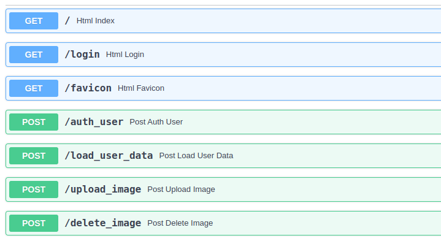
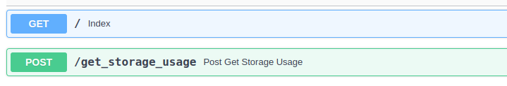

# controller-service

- **Port**: 80
- **Storage Units Used**: Application Logs
- **Code**: [controller-service](controller-service/README.md)
- **Image Source**: [ghcr.io/geetu040/pixa-controller-service](https://github.com/users/geetu040/packages/container/package/pixa-controller-service)

# auth-service

- **Port**: 5000
- **Storage Units Used**: User Database, Application Logs
- **Code**: [controller-service](auth-service/README.md)
- **Image Source**: [ghcr.io/geetu040/pixa-auth-service](https://github.com/users/geetu040/packages/container/package/pixa-auth-service)

# storage-account-service

- **Port**: 5001
- **Storage Units Used**: Image Storage, Application Logs
- **Code**: [storage-account-service](storage-account-service/README.md)
- **Image Source**: [ghcr.io/geetu040/pixa-storage-account-service](https://github.com/users/geetu040/packages/container/package/pixa-storage-account-service)

# storage-monitor-service

- **Port**: 8000
- **Storage Units Used**: Image Storage, Application Logs
- **Code**: [storage-monitor-service](storage-monitor-service/README.md)
- **Image Source**: [ghcr.io/geetu040/pixa-storage-monitor-service](https://github.com/users/geetu040/packages/container/package/pixa-storage-monitor-service)

# usage-monitor-service

- **Port**: 8001
- **Storage Units Used**: Image Storage Logs, Application Logs
- **Code**: [usage-monitor-service](usage-monitor-service/README.md)
- **Image Source**: [ghcr.io/geetu040/pixa-usage-monitor-service](https://github.com/users/geetu040/packages/container/package/pixa-usage-monitor-service)